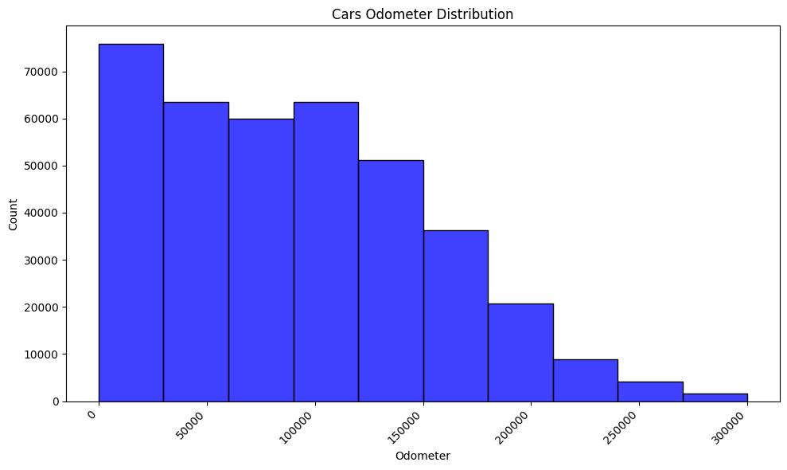
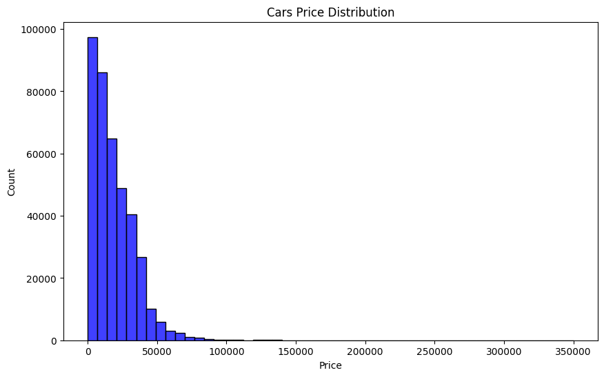
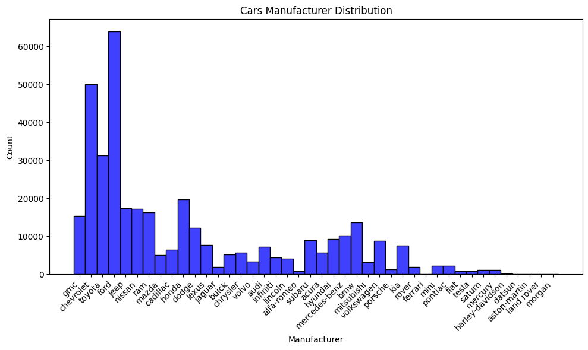
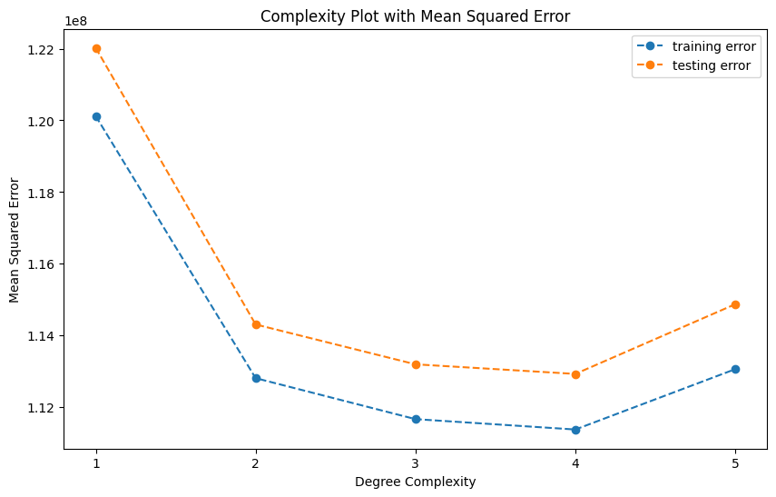
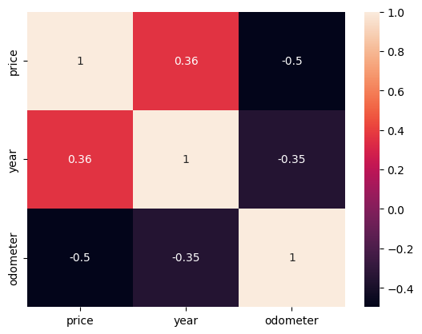
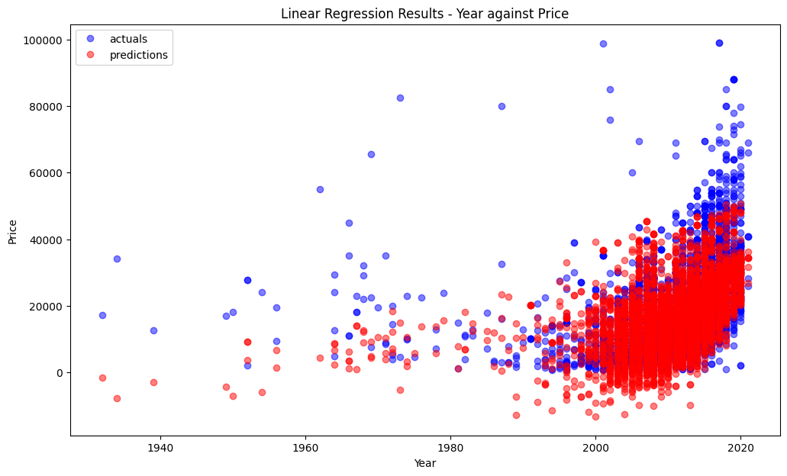
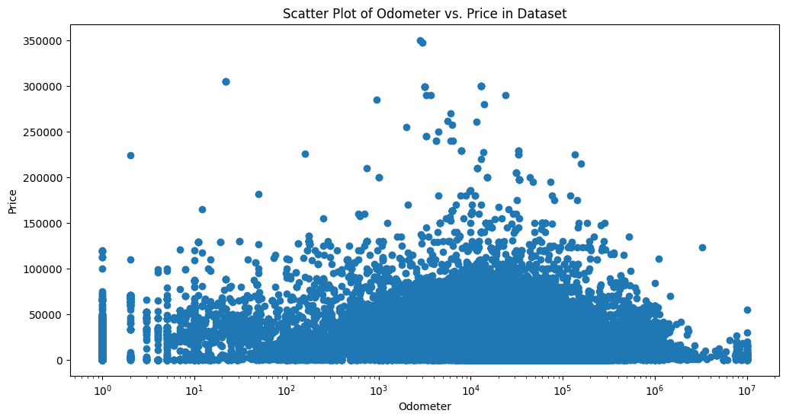

**What Drives the Price of a Car?** 
This project analyzes a large dataset of used cars to determine what factors influence car prices. The dataset, ~426,000 cars is used here. 
The analysis follows the CRISP-DM framework, a widely used industry process for data science projects. The ultimate goal is to provide insights for a used car dealership on   what consumers value in a used car, enabling better pricing, acquisition, and sales strategies. 

**Project Objectives** 
1.	Explore the dataset and understand its structure. 
2.	Clean and preprocess the data (handle missing values, drop irrelevant columns, encode categorical features). 
3.	Identify key features that impact the price of a car. 
4.	Provide business recommendations for dealerships and sales teams. 
**Steps taken to analyze the project** 
The steps to take to describe the data include the following 
1.	read the data from vehicles.csv 
2.	Get the information about the columns in the data 
3.	Use describes to get basic stats for the data for numerical columns including id, price, year, odometer. 
4.	Under the categorical data 
**Methodology** 
This project is structured around the CRISP-DM framework: 
1.	Business Understanding 
o	Identify the key features that matters most to dealerships and sales teams. 
o	Success if defined by pinpointing the car features that drive higher resale prices. 
2.	Data Understanding 
o	Summary statistics and visual exploration of the dataset. 
o	Checking duplicates, missing values, and categorical distributions. 
3.	Data Preparation 
o	Cleanup data by 
o	Dropping irrelevant or redundant columns. 
o	Handling missing values (removal or imputation). 
o	Encoding categorical variables (e.g one-hot encoding). 
o	Feature scaling for numerical attributes if required. 
4.	Modeling & Exploration 
o	Correlation analysis of features with price. 
o	Feature importance ranking using ML models (Linear Regression, etc.). 
o	Visualizations of price distributions across categorical and numeric features. 
5.	Evaluation 
o	Interpretability of feature importance. 
o	Which features explain most of the price variance. 
6.	Deployment / Recommendations 
o	Provide actionable insights for dealerships: 
o	Which features increase car value. 
o	Which features have little/no effect. 
o	Strategic inventory and pricing guidelines. 
**Key Insights** 
•	Mileage, age of the car, and diesel are strong predictors of price. 
•	Some columns (e.g., VIN, ID numbers) add no predictive value and were dropped. 
•	Dealerships can optimize inventory acquisition by focusing on makes/models that hold value better. 
•	Sales teams can tailor offers knowing which features customers value most. 

 **Example Visualizations** 
•	Distribution of car prices. 
•	Correlation heatmap of numerical features. 
•	Feature importance bar charts. 
•	Box plots of categorical features (e.g., make, color) vs. price. 

**Various Charts from the Project** 

